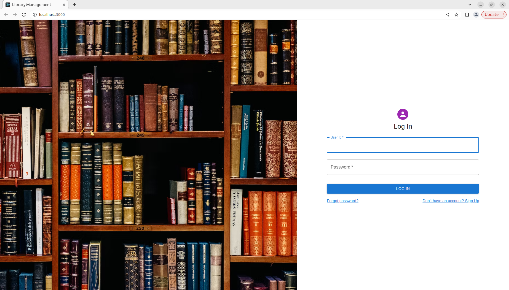
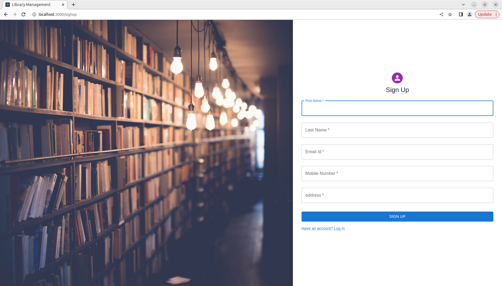

# Library Management

[//]: # (## Error)

[//]: # (![image]&#40;https://user-images.githubusercontent.com/46570973/213371477-8b06c3fe-1cd3-4d3c-bcea-ad8cfc6b5799.png&#41;)

## Register Screen
    - user get registered 
    - mail get sent
    - Approve mail
    - After that "Here are your login creds"
    - Now user will login through these creds

## Login 
    - After login user will redirect to "Profile page"

## My profile (UI)
    - User details will show
    - Photo update

## Screenshots

